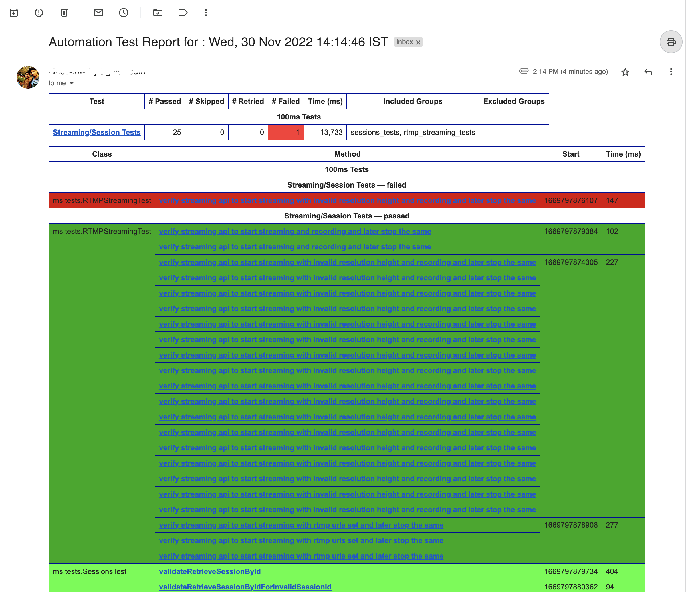

100ms backend assignment

API automation

To get token to run the API can be found from here https://www.100ms.live/docs/server-side/v2/introduction/authentication-and-tokens
Also you need to create a dashboard account at 100ms https://dashboard.100ms.live/ to get app secret and key from the developer section once you have login into dashboard.

	•	Refer the link for curl command  
https://www.100ms.live/docs/server-side/v2/Destinations/rtmp-streaming-and-browser-recording - Automate for both start and stop as well
https://www.100ms.live/docs/server-side/v2/Sessions/retrieve-a-session

	•	The beam streaming / recording api with sessions API as well  needs to be automated with all the cases that you can think off. Eg verify with optional param, all permutation , positive and negative cases and their respective error code and message.

	•	Also integrate this with slack or mail to get reports. (Good to have)

Do reach out to us if you have any queries.

- Uses TestNG, RestAssured, Maven tools.
- Uses Log4j for logging. RestAssured logs for request and response for Endpoints are also logged to log4j
- JSON Schema validation
- Email reporting enabled via EmailReportListener
- Tests are in src/test/java/ms/tests

Sample Email Report screenshot : 

- Log files are attached to the email.

To run tests of a particular group:

mvn clean test -DsuiteXmlFile=testng.xml -Dgroups=<group_name> -Dapp_access_key=<app_access_key> 
-Dapp_secret=<app_secret> -Duser_email=<reciever_mail> -Dsender_email=<sender_mail> 
-Dsender_password=<sender_password>

